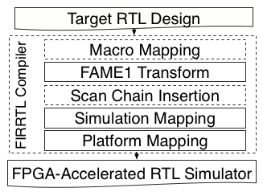

# MIDAS Beta v0.1

MIDAS is a simulation framework that automatically generates an FPGA-accelerated simulator from a Chisel-based RTL design. MIDAS expands on the work of [Strober](http://dl.acm.org/citation.cfm?id=3001151) that was originally developed for sample-based energy simulation.

## Host vs Target 

To avoid confusion, we make a distinction between *host* and *target* machines.

**Target**: the machine being simulated. For example, an SoC derived from Rocket Chip.

**Host**: the machine that executes ("hosts") the simulation. For example, this could be an Xilinx ZC706 (FPGA + embedded CPU), or an X86 desktop with a PCI-E attached FPGA like a Xilinx VC707, or Intel DE5.

MIDAS's primary function is to generate a high-performance simulator of a *target* from its source RTL, that executes on a hybrid CPU-FPGA *host*.

## Dependencies

This repository depends on the following projects:
* [Chisel](https://github.com/freechipsproject/chisel3): Target-RTL that MIDAS transformed must is written in Chisel RTL. Additionally, MIDAS RTL libraries are all written in Chisel. 
* [FIRRTL](https://github.com/freechipsproject/firrtl): Transformations of target-RTL are transformed using FIRRTL compiler passes.
* [RocketChip](https://github.com/freechipsproject/rocket-chip.git): Rocket Chip is not only a chip generator, but also a collection of useful libraries for various hardware designs. 
* [barstools](https://github.com/ucb-bar/barstools): Some additional technology-dependent custom transforms(e.g. macro compiler) are required when Strober energy modelling is enabled.

This repository is not standalone: it must be included in a top-level project with its dependencies and the source of the target design you wish to simulate. We provide two examples of this: [strober-examples](https://github.com/donggyukim/strober-examples), which applies MIDAS to a collection of more-simple Chisel designs, and [midas-top](https://github.com/ucb-bar/midas-top.git), which demonstrates how MIDAS may be used in a Rocket Chip-based SoC project.

## Getting Started

### MIDAS Compiler

First of all, we assume the target design is written in Chisel. To generate the FPGA simulator for the target design, just pass the target design with a configuration to `MidasCompiler`:
```scala
// mod: Module (target design)
// dir: File (target directory)
// p: config.Parameters (midas configuration)
midas.MidasCompiler(mod, dir)(p)
```

If you have a JSON file describing the target technology generated by [PLSI](https://github.com/ucb-bar/hammer), pass it as:
```scala
// lib: File (technology description)
midas.MidasCompiler(mod, dir, Some(lib))(p)
```

Here are two examples in [strober-example](https://github.com/donggyukim/strober-examples/blob/master/src/main/scala/Main.scala) and [midas-top](https://github.com/ucb-bar/midas-top/blob/master/src/main/scala/Generator.scala).

### MIDAS Configurations

The default MIDAS parameters are given in [src/main/scala/midas/Config.scala](https://github.com/ucb-bar/midas/blob/readme/src/main/scala/midas/Config.scala). You can just pass `ZynqConfig` to obtain performance simulation and `ZynqConfigWithSnapshot` to plug Strober in for power/energy simulation for Xilinx Zynq boards.

You may want to override some parameters on top of the default parameter values. This is an example how you can instantiate an MIDAS LLC model:
```scala
class WithMidasLLC(extends Config((site, here, up) => {
  case MidasLLCKey => Some(MidasLLCParameters(nWays = 8, nSets = 4096, blockBytes = 128)) // capacity <= 4MiB
})

class ZynqConfigWithLLC(new ZynqConfig ++ new WithMidasLLC)
```

### MIDAS Software Driver

To take control of FPGA simulation, the software driver is suppposed to be written in C++ by the users. The simplest way to write is use `peek`, `poke`, `step`, `expect` functions as in Chisel testers. The first step is write a virtual class shared by emulation and various platforms. This is a software driver for GCD (e.g. in `GCD.h`) by inheriting `simif_t` as an example:
```c++
#include "simif.h"

class GCD_t: virtual simif_t
{
public:
  void run() {
    uint32_t a = 64, b = 48, z = 16; //test vectors
    target_reset();
    do {
      poke(io_a, a);
      poke(io_b, b);
      poke(io_e, cycles() == 0 ? 1 : 0);
      step(1);
    } while (cycles() <= 1 || peek(io_v) == 0);
    expect(io_z, z);
  }
};
```

Next, to emulate and test the FPGA simulator itself, a drieved class is written (e.g. in `GCD-emul.cc`) as follow:

```c++
#include "simif_emul.h"
#include "GCD.h"

class GCD_emul_t:
  public simif_emul_t,
  public GCD_t { };

int main(int argc, char** argv)
{
  GCD_emul_t GCD;
  GCD.init(argc, argv, true);
  GCD.run();
  return GCD.finish();
}
```

For FPGA simulation in Xilinx Zynq, the code (e.g. in `GCD-zynq.cc`) is written in the same way inheriting `simif_zynq_t` instead of `simif_emul_t`:

```c++
#include "simif_zynq.h"
#include "GCD.h"

class GCD_zynq_t:
  public simif_zynq_t,
  public GCD_t { };

int main(int argc, char** argv) 
{
  GCD_zynq_t GCD;
  GCD.init(argc, argv, true);
  GCD.run();
  return GCD.finish();
}
```

In this way, we can reduce lots of code duplication for emulation and various platforms when the software driver becomes complicated.

Big numbers more than 64 bits can be defined by `mpz_t` in [GMP](https://gmplib.org/), and passed to `peek`, `poke`, `expect` functions.

To compile the driver, `make` is invoked in `src/main/cc`. Thus, the top-level makefile is likely to contain the wrapper as follows:
```makefile
compile-driver:
  $(MAKE) -C $(midas_dir)/src/main/cc [verilator | vcs | zynq] [variable="<value>"]*
```

The variables are:
* `PLATFORM`: Platform name (zynq by default)
* `DESIGN`: Target design name
* `GEN_DIR`: The directory containing generated files from MIDAS Compiler (=`dir`)
* `OUT_DIR`: The directory for output files (`GEN_DIR` by default)
* `DRIVER`: The driver files written by the user (not including header files)
* `CXXFLAGS`: additional compiler flags

### FPGA Simulation Synthesis

To compile the FPGA simulator, platform specific backend flows are provided. For now, [the Xilinx Zynq backend](https://github.com/ucb-bar/midas-zynq) is supported by modifying [RocketChip fpga-zynq](https://github.com/ucb-bar/midas-zynq).

### Run emulation / FPGA simulation

To run emulation / FPGA simulation, simply run:
```
cd <output_dir>
./[binary executable] [+<argument>=<value>]
```

The argument list is as follows:
* `+mm_MEM_LATENCY=`: the DRAM latency (required)
* `+mm_LLC_LATENCY=`: the LLC latency (required when using the LLC model)
* `+mm_LLC_WAY_BITS=`: log2(#(LLC ways)) (required when using the LLC model)
* `+mm_LLC_SET_BITS=`: log2(#(LLC sets)) (required when using the LLC model)
* `+mm_LLC_BLOCK_BITS=`: log2(#(LLC block size)) (required when using the LLC model)
* `+loadmem=`: hex file to initialize the main memory
* `+fastloadmem`: enables fast loadmem, not through the loadmem unit (emulation only)
* `+seed=`: seed value for the random generator (optional)
* `+sample=`: file name for sample snapshots (strober only)
* `+samplenum=`: number of sample snapshots (strober only)
* `+tracelen=`: the length of I/O traces (strober only)

Note that emulation and FPGA simulation share most command-line arguments.

### Templates / Examples

There are two templates you can start with:
* [strober-example](https://github.com/donggyukim/strober-examples.git): Strober for very simple and small examples.
* [midas-top](https://github.com/ucb-bar/midas-zynq.git): MIDAS/Strober for RocketChip and BOOM.

## Internal Architecture

This section describes the internal architecture of MIDAS for advanced users.

### Custom Transforms in the MIDAS Complier

The [`MidasTransforms`](src/main/scala/midas/passes/MidasTransforms.scala) composes custom compiler passes to generate FPGA simulators as follows:


Note that the MIDAS compiler operates on low firrtl to take advantage of low-level optimizations from the FIRRTL compiler.

### Macro Mapping (Optional)

*Macro Mapping* maps technology-independent macro blocks to technology-dependent macro blocks(SRAMs). This pass is initiated by passing the JSON description to the MIDAS compiler. For implementation details, refer to [barstools](https://github.com/ucb-bar/barstools).

### FAME1 Transform
[*FAME1 transform*](src/main/scala/midas/passes/Fame1Transform.scala) decouples the target clock from the host clock by attaching enable signals to all state elements. This enables FPGA performance simulators to stall when timing tokens are not ready. With FAME1 transforms, we can easily control the execution of FPGA simulation with timing token flow controls. The details of this transform are found in [the ISCA'16 paper](http://dl.acm.org/citation.cfm?id=3001151).

### Scan Chain Insertion (Optional)
[*Scan chain insertion*](src/main/scala/strober/passes/AddDaisyChain.scala) add scan chains to take RTL state snapshots for sample replays. Notably, [*all scan chains are implemented in Chisel*](src/main/scala/strober/core/DaisyChain.scala), and this pass compiles the Chisel designs by invoking the FIRRTL compiler inside a FIRRTL pass. This technique, called *Inline Compilation*, removes the necessity of writing all hardware logic with IR, reducing the pass writing overhead significantly. In addtion, the scan chain information is dumped (e.g. `<design>.chain`) by [another compiler pass](src/main/scala/strober/passes/DumpChain.scala). The details of scan chains are found in [the ISCA'16 paper](http://dl.acm.org/citation.cfm?id=3001151).

### Simulation Mapping
[*Simulation mapping*](src/main/scala/midas/passes/SimulationMapping.scala) wraps the transformed target design by inserting timing token channels / trace buffers. The result is a platform-independent simulation module for token-based simulation. This pass compiles [the wrapper written in Chisel](src/main/scala/midas/core/SimWrapper.scala) with *Inline Compilation*. The details on communication channels and token-based simulation are found in [the ISCA'16 paper](http://dl.acm.org/citation.cfm?id=3001151).

### Platform Mapping
[*Platform mapping*](src/main/scala/midas/passes/PlatformMapping.scala), the heart of MIDAS, links all simulation modules hosted on FPGA with platform specific logic. First of all, [`FPGATop`](src/main/scala/midas/core/FPGATop.scala) instantiates and connects abstrace modules and helpers implemented using [`Widget`](src/main/scala/midas/widgets) as well as the target module generated by simulation mapping. Next, there are [platform-specific shims](src/main/scala/midas/platform) to adapt the AXI master-slave interface to the platform-specific interfaces. As a final step, the compiler pass compiles the platform shim with *Inline Compilation*, dumps a target and platform specific C++ header file (`<design>-const.h`) for the software driver, and thus, generates the FPGA simulator.

## Advanced Usage

### Endpoints

The easiest way to write a testbench for the software driver is use `poke`, `peek`, `expect` for each I/O port along with `step`. However, this may not be proper in many situations as it increases communication overhead between the FPGA and the software driver. Thus, we introduce [`Endpoint`](src/main/scala/midas/core/Endpoints.scala) that translates the tokens into higher-level transactions and vice versa through [a specialized `Widget`](src/main/scala/midas/widgets/NastiIO.scala). The intuition behind is the systems we are building are nicely divided into FPGA and software sush that the commucations between them are rare (e.g. through decoupled channels). Note that [the memory timing model](src/main/scala/midas/widgets/SimpleLatencyPipe.scala) is an example endpoint. We also have examples in midas-top ([scala code](https://github.com/ucb-bar/midas-top/tree/master/src/main/scala/endpoints), [c++ code](https://github.com/ucb-bar/midas-top/tree/master/src/main/cc/endpoints)) you can easily follow on.

#### Custom Endpoint Widget Implementation

First, implement a custom endpoint widget by inheriting `midas.widget.EndpointWidget`. Also, declare `hPort` in `midas.widget.EndpointWidgetIO` with the type of the top-level I/O ports. `hPort`. The top-level target design ports on which the endpoint operates are wrapped by `hPort` of type `HostPortIO` that has three following fields:

* `fromHost`: ready/valid signals for tokens from the host side (toward the target design).
* `toHost`: ready/valid signals for tokens toward the host side (from the target design).
* `hBits`: signals seen by target design with the same type of the target ports. In general, its type is an aggregated type (e.g. `DecoupledIO`).

Target reset tokens are presented through `tReset` as `DecoupledIO`. Thus, define *fire* with `io.hPort.toHost.hValid`, `io.hPort.fromHost.hReady`, `io.tReset.valid`, which means all timing tokens from the target design are presented and the target is ready to accept timing tokens from the widget, and additional timing conditions if necessary. Then, the tokens from the widget are generated by connecting *fire* to `io.hPort.fromHost.hValid`. In the same way the tokens toward the widget are consumed by connecting *fire* to `io.hPort.toHost.hReady` and `io.tReset.ready`. In addition, define *done* which indicates all outstanding transactions are done and no more timing tokens are avaiable from the target design.

Next, add buffers for the transactions and connect them to `io.hPort.hBits`. In general, transactions are modeled with `DecoupledIO`, but there are exceptions like UART. Timing is also modeled with respect to outstanding transactions. All transactions and timing information is exhanged through their coresponding buffers.

Finally, generate memory-mapped registers for the transaction buffers and control/status signals with the following functions:
```scala
/*** The following functions return assigned addresses ***/
// assign an address to `reg` and attach to the control register file
def attach(reg: Data, name: String, permissions: Permissions = ReadWrite): Int
// generate a register for `wire` and attach to the control register file
// masterDriven = true if wire is output of target
def genAndAttachReg[T <: Data](wire: T, name: String, default: Option[T] = None, masterDriven: Boolean = true): Int
// attach the sink of the buffer and attach to the control register file
def attachDecoupledSink(channel: DecoupledIO[UInt], name: String): Int
// attach the source of the buffer attach to the control register file
def attachDecoupledSource(channel: DecoupledIO[UInt], name: String): Int

/*** The following functions return generated registers ***/
// generate a write-only register for `wire` and attach to the control register file
def genWOReg[T <: Data](wire: T, name: String): T
def genWORegInit[T <: Data](wire: T, name: String, default: T): T
// generate a read-only register for `wire` and attach to the control register file
def genROReg[T <: Data](wire: T, name: String): T
def genRORegInit[T <: Data](wire: T, name: String, default: T): T
```
`name` is used to generate macros for memory-mapped registers. Note that the maximum width of each communication is platform-dependent (given as `io.ctrl.nastiXDataBits`), so each word should be chopped and sent if it exceeds the max width. Finally, don't forget to call `genCRFile()` at the end, which elaborates all assigned control registers. The APIs are not finialized yet, so they are subject to change in later releases.

#### Custom Endpoint Widget Instantiation

Declare `matchType` and `widget` in the inherited class of [`midas.core.Endpoint`](src/main/scala/midas/core/Endpoints.scala). The `matchType` method finds the type of the top-level I/O ports on which the endpoint widget operates. The `widget` method instantiates the endpoint widget. The endpoints are instantiated with the parameter `EndpointKey` such as:
```scala
class WithMyEndpoints extends Config(new Config((site, here, up) => {
  case midas.EndpointKey =>
    // Includes all endpoints defined by the default config
    up(EndpointKey) ++
    // Adds custom endpoints
    midas.core.EndpointMap(Seq(new MyEndpoint1, new MyEndpoint2))
}

class MyZynqConfig extends Config(new WithMyEndpoints ++ new midas.ZynqConfig)
```

#### Write Endpoint Software

To write endpoint software, implement a derived class of [`endpoint_t`](https://github.com/ucb-bar/midas/blob/readme/src/main/cc/endpoints/endpoint.h). You are supposed to implement two methods.

* `tick`: performs operations on outstanding transactions.
* `done`: informs whether or not all timing tokens from the target designs are consumed.

Therefore, in the software driver, non-blocking `n` steps are taken with `step(n, false)`, and `tick` functions of all endpoints are called until they are `done`.

`tick` and `done` are implemented using `read` and `write` functions for memory-mapped registers. Once custom endpoints are instantiated, macros for memory mapped registers are generated in `<Design>-const.h`. If you implemented an endpoint widget `FooWidget` and generated a memory mapped reigster with `name` being `"bar"`, this register can be read and written with `read(FOOWIDGET_0(bar))` and `write(FOOWIDGET_0(bar), ...)`, respectively.

### Porting to Other FPGA Platforms

TODO.

## Publications

* Donggyu Kim, Adam Izraelevitz, Christopher Celio, Hokeun Kim, Brian Zimmer, Yunsup Lee, Jonathan Bachrach, and Krste Asanović, **"Strober: Fast and Accurate Sample-Based Energy Simulation for Arbitrary RTL"**, International Symposium on Computer Architecture (ISCA-2016), Seoul, Korea, June 2016. ([Paper](https://dl.acm.org/citation.cfm?id=3001151), [Slides](http://isca2016.eecs.umich.edu/wp-content/uploads/2016/07/2B-2.pdf))
* Donggyu Kim, Christopher Celio, David Biancolin, Jonathan Bachrach, and Krste Asanović, **"Evaluation of RISC-V RTL with FPGA-Accelerated Simulation"**, The First Workshop on Computer Architecture Research with RISC-V (CARRV 2017), Boston, MA, USA, Oct 2017. ([Paper](doc/papers/carrv-2017.pdf), [Slides]())
